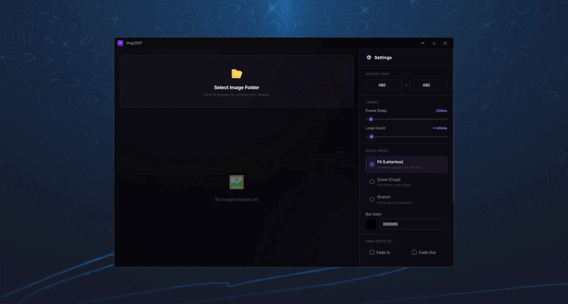

# Img2Gif

A fast, modern, and lightweight application designed to convert sequences of images into high-quality animated GIFs. Built with a focus on ease of use and visual appeal, Img2Gif provides a sleek user interface using Wails and a robust backend powered by Go.

## Features

- **High-Quality Conversion**: Generates smooth and clear GIFs using optimized FFmpeg configurations.
- **Modern UI/UX**: Built with Vanilla web technologies (HTML/CSS/JS) for a responsive and intuitive design.
- **Cross-Platform**: Developed using the Wails framework, allowing you to build native-like binaries for Windows, macOS, and Linux from a single codebase.

## Demo



## Getting Started

This project is built using the [Wails](https://wails.io/) framework.

### Prerequisites

- [Go](https://go.dev/) (latest version recommended)
- [Wails CLI](https://wails.io/docs/gettingstarted/installation)
- **FFmpeg** (Required for the program to function, see installation instructions below)

### Installing FFmpeg

> [!IMPORTANT]
> This application relies heavily on FFmpeg to process and generate the GIF files. You must have FFmpeg installed and available in your system's PATH.

**Windows:**
You can install FFmpeg via [Winget](https://learn.microsoft.com/en-us/windows/package-manager/winget/) or [Scoop](https://scoop.sh/):
```powershell
winget install ffmpeg
# OR
scoop install ffmpeg
```

**Linux (Ubuntu/Debian):**
```bash
sudo apt update
sudo apt install ffmpeg
```


### Live Development

To run the application in live development mode, simply execute the following command in the project root directory:

```bash
wails dev
```

This will start the application with hot-reloading enabled for the frontend. Any changes made to your frontend assets or Go code will be reflected immediately.

## Building for Production

To create a standalone, optimized, and redistributable binary package, run:

```bash
wails build
```

This command will output the compiled executable in your `build/bin` directory, ready to be shared and executed.
